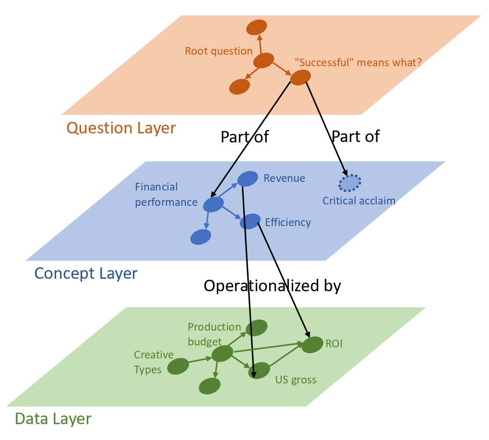

# Design Intent Dashboard Recommendation

## Motivation: 
Dashboard designers are currently on their own to interpret given data, analyst/domain objectives, and design practices for dashboard components. There are dashboard recommendation systems but they employ template-based approaches to generate dashboard components. 
## Approach: 
Our team utilizes LLMs generate dynamic and nuanced dashboard recommendations based on a user's natural language intent and a data set. To construct dashboard recommendations we, build data representations between three layers of abstracted information: Natural language | Conceptual | Data. 

To connect these layers of information we construct the following graphs:

1. User Intent Graph (not implemented)
2. Domain Knowledge Graph (2 implementations)
3. Data Causal Graph (1 implementation)

The Domain Knowledge Graph:

Given a user's natural language dashboard intent, we leverage the knowledge and linguistic connection building of Gemini 2.5 to construct a knowledge graph of domain knowledge.

*[movie dataset example]*

The Data Causal Graph:

This graph is made by developing a data summarizer for a given dataset which is then prompted with Gemini 2.5 along with the user's natural language intent to develop a uni-directional casual graph.

*[movie dataset example]*

